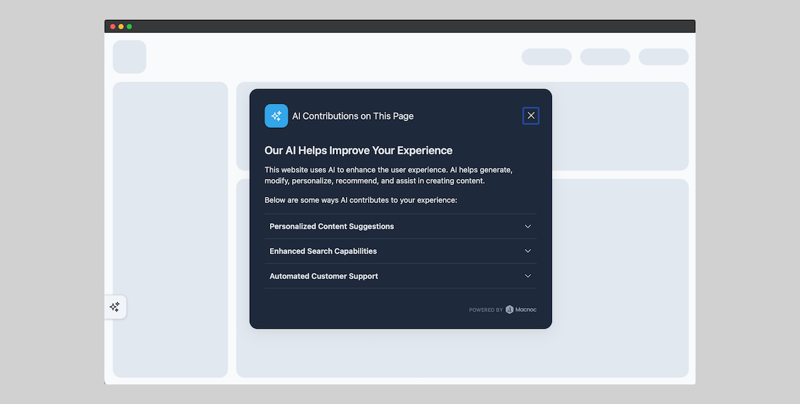
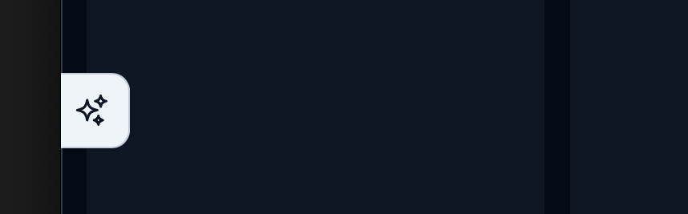
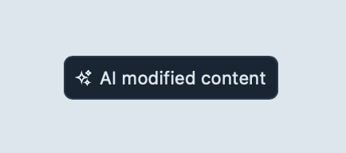

# ADCN (AI-Generated Content Notifier)

ADCN is a simple, lightweight JavaScript utility that helps website owners and developers inform their visitors when content on the site has been generated by AI. With the rise of AI-generated content, it's crucial to be transparent with users. This tool offers a way to disclose AI involvement in content creation in a user-friendly way.



## Table of Contents

- [Key Benefits](#key-benefits)
- [Features](#features)
- [Accessibility](#accessibility)
- [The Badge](#badge)
- [Information Modal](#information-modal)
- [Notice Element](#notice)
- [Installation](#installation)
    - [CDN (Recommended)](#cdn-recommended)
    - [Local Installation](#local-installation)
- [Usage](#usage)
- [Configuration](#configuration)
    - [Config object](#config)
    - [Content object](#content)
    - [Sections object](#sections)
    - [Notices Configuration](#notices-configuration)
- [Styling](#styling)
    - [CSS Variables](#css-variables)
    - [Dark Mode](#dark-mode)
- [ADCN class](#ADCN-class)
    - [init(config | object)](#init)
    - [update(config | object)](#update)
    - [openModal()](#openModal)
    - [destroy()](#destroy)
- [Contributing](#contributing)
- [License](#license)

## Key Benefits

- Builds user trust by promoting AI transparency.
- Helps websites comply with potential future AI transparency regulations.
- Simple setup with minimal code footprint.

## Features

- Easily integrates into any website.
- Displays a notification banner when AI-generated content is detected.
- Customizable appearance and message.

## Accessibility

The widget is designed with accessibility in mind. The modal dialog includes ARIA attributes to ensure that it is accessible to all users. The modal is also focus-trapped to prevent users from tabbing outside the modal. The badge and modal are keyboard accessible, and the modal can be closed using the escape key.

## Svelte as a Framework

The widget is built using Svelte, a modern web framework that compiles to highly optimized vanilla JavaScript. Svelte is a great choice for building web components and widgets due to its simplicity and performance. The widget is compiled to a standalone JavaScript file that can be easily included in any website.

[Read more about Svelte](https://svelte.dev/)

## Badge



The badge is a small clickable element that appears on the edge of the screen. It can be configured to appear in different positions:

- `top-right`
- `bottom-right`
- `top-left`
- `bottom-left`

## Information Modal

The information modal is a dialog that provides detailed information about the website's use of AI. It includes a title, body content, and sections that can be expanded to show more details. The modal is accessible and includes ARIA attributes and focus trapping to ensure a good user experience.

## Notice Element



Notices are elements that can be placed anywhere on the page using the `data-ai-content` attribute. They display different types of notices based on the content provided in the configuration.

## Installation

You can include ADCN in your project by linking directly to the CDN or by downloading the script.

### CDN (Recommended)

Add this to your HTML before the closing `</body>` tag:

```html
<script src="https://cdn.jsdelivr.net/gh/macnoc/ADCN@latest/dist/adcn.min.iife.js"></script>
```

### Local Installation
1.	Download the latest version from the [Releases](https://github.com/macnoc/ADCN).
2.	Link to the script in your HTML file:

```html
<script src="path/to/adcn.min.iife.js"></script>
```

## Usage

To enable the widget, simply add the following JavaScript to your webpage:

```javascript
const widget = new ADCN();
```

This will create a new instance of the ADCN widget with the default configuration. The widget will automatically add the badge to the screen and display the modal when clicked.

You can customize the widget by passing a configuration object to the `ADCN` constructor. For example:

```javascript
const widget = new ADCN({
    config: {
        //...
    },
    content: {
        //...
    }
});
```

## Configuration

The widget can be configured using the following options:

- `config`: An object containing configuration options such as language, badge position, support, and whether to show the badge.

- `content`: An object containing the content to be displayed in the modal and notices. This includes the header, title, body, sections, and notices.

### Config

| Option | Type | Description | Default |
| --- | --- | --- | --- |
| `language` | `string` | The language to use for the widget. | `'en'` |
| `showBadge` | `boolean` | Whether to show the badge on the screen. | `true` |
| `badgePosition` | `string` | The position of the badge on the screen. | `'top-right'` |
| `support` | `boolean` | Powered-by link to Macnoc. | `true` |

### Content

Each language has its own content configuration. For example, the English content configuration would look like this:

```javascript
const widget = new ADCN({
    config: {
        //...
    },
    content: {
        en: {
            //...
        },
        fr: {
            //...
        }
    }
});
```

The content object contains the following options:

| Option | Type | Description | Default |
| --- | --- | --- | --- |
| `header` | `string` | The header text for the modal. | `'AI Contributions on This Page'` |
| `title` | `string` | The title of the modal. | `'Our AI Helps Improve Your Experience'` |
| `body` | `string` | The body text of the modal. Html is supported. | `'This website uses AI to enhance the user experience.'` |
| `sectionsHeader` | `string` | The header text for the sections in the modal. | `'Below are some ways AI contributes to your experience:'` |
| `sections` | `array` | An array of objects representing sections in the modal. | `[]` |
| `notices` | `array` | An array of objects representing notices to display. | `[]` |

### Sections

Each section object contains the following options:

| Option | Type | Description | Default |
| --- | --- | --- | --- |
| `title` | `string` | The title of the section. | `'Section Title'` |
| `body` | `string` | The content of the section. Html is supported. | `'Section content goes here.'` |

## Notices Configuration

The `notices` configuration allows you to customize the messages displayed by the ADCN widget for different types of AI-generated content. By default, the configuration includes the following notices:

| Notice | Description |
| --- | --- |
| `generated` | AI generated content |
| `modified` | AI modified content |
| `personalized` | AI personalized content |
| `recommended` | AI recommended content |
| `assisted` | AI assisted content |

## Example

Here is an example of how to configure the widget with custom content:

```javascript
const widget = new ADCN(config: {
        language: "en",
        support: true,
        showBadge: true
    },
    content: {
        en: {
            header: "AI Contributions on This Page",
            title: "Our AI Helps Improve Your Experience",
            body: "This website uses AI to enhance the user experience. AI helps generate, modify, personalize, recommend, and assist in creating content.",
            sectionsHeader: "Below are some ways AI contributes to your experience:",
            notices: {
                generated: "AI generated content",
                modified: "AI modified content",
                personalized: "AI personalized content",
                recommended: "AI recommended content",
                assisted: "AI assisted content"
            },
            sections: [
          {
            title: "Personalized Content Suggestions",
            body: "Our AI algorithms analyze your browsing behavior to provide personalized content suggestions."
          },
            {
                title: "Recommended Products",
                body: "Our AI system recommends products based on your browsing history and preferences."
            }
        ]
    }
});
```


## Styling

The widget includes global styles for consistent design. You can customize the appearance of the widget by overriding the default styles in your CSS file. Please override CSS variables to customize the widget's appearance.

### CSS Variables

The following CSS variables are available for customization:

```css
.adcn-container {
    --main-color: #0ea5e9;
    --text-color: #0f172a;

    --badge-bg-color: #1e293b;
    --badge-color: #f1f5f9;
    --badge-border-color: #334155;
    --badge-bg-color-hover: #0f172a;
    --badge-offset: 8rem;

    --modal-bg-color: #f8fafc;
    --modal-border-color: #cbd5e1;
    --modal-icon-color: #f1f5f9;

    --support-color: #94a3b8;

    --accordion-open-bg-color: #f1f5f9;

    --font-family: -apple-system, BlinkMacSystemFont, "Segoe UI", Roboto, Helvetica, Arial, sans-serif, "Apple Color Emoji", "Segoe UI Emoji", "Segoe UI Symbol";
}

.adcn-notice {
    --bg-color: #f1f5f9;
    --border-color: #cbd5e1;
    --text-color: #64748B;
    --font-family: -apple-system, BlinkMacSystemFont, "Segoe UI", Roboto, Helvetica, Arial, sans-serif, "Apple Color Emoji", "Segoe UI Emoji", "Segoe UI Symbol";
}
```

### Dark Mode

The widget includes a dark mode with `prefers-color-scheme: dark` media query. You can customize the dark mode styles by overriding the default css variables in your CSS file.

```css
@media (prefers-color-scheme: dark) {
    .adcn-container {
        /* ... */
    }

    .adcn-notice {
        /* ... */
    }
}
```

## ADCN class

The `ADCN` class is the main class that creates the widget. It has several methods for initializing, updating, and destroying the widget.

### `init(config | object)`

The `init` method initializes the widget and adds the badge to the screen. It also sets up event listeners for the badge and modal.

#### Parameters

- `config` (object): An object containing configuration options for the widget.

### `update(config | object)`

The `update` method updates the widget with new configuration options. It deep merges the new options with the existing options and updates the badge and modal with the new configuration.

#### Parameters

- `config` (object): An object containing configuration options to update the widget.

### `openModal()`

The `openModal` method opens the information modal.

### `destroy()`

The `destroy` method removes the badge from the screen and cleans up event listeners.

## Contributing

Feel free to fork the project, submit issues, and open pull requests. If you have any improvements or bug fixes, don’t hesitate to contribute!

## License

This project is licensed under the MIT License. See the LICENSE file for more details.